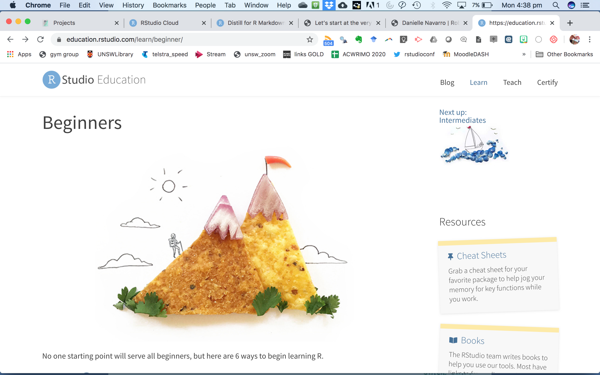
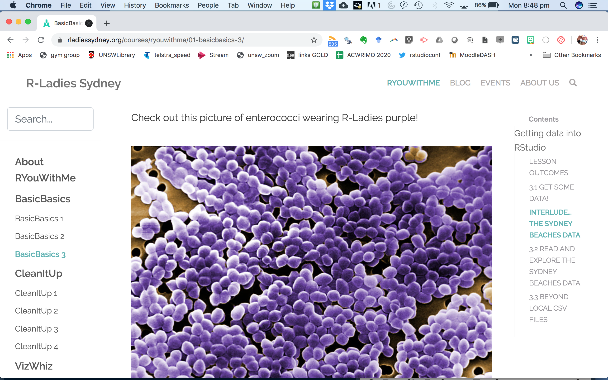
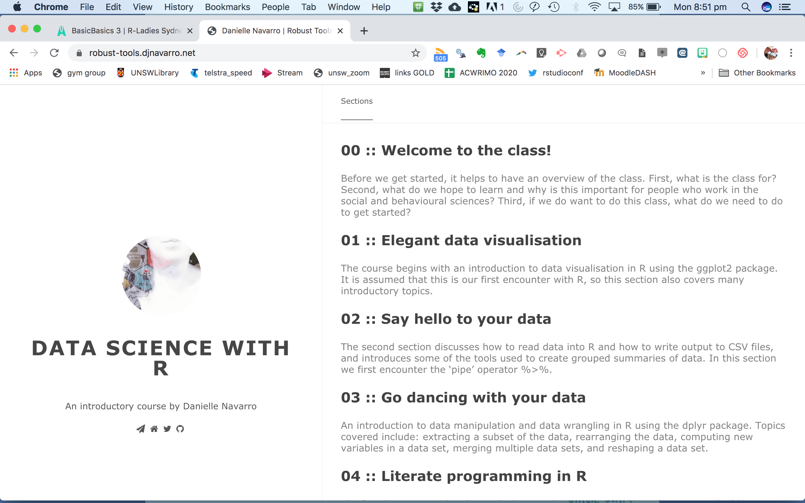
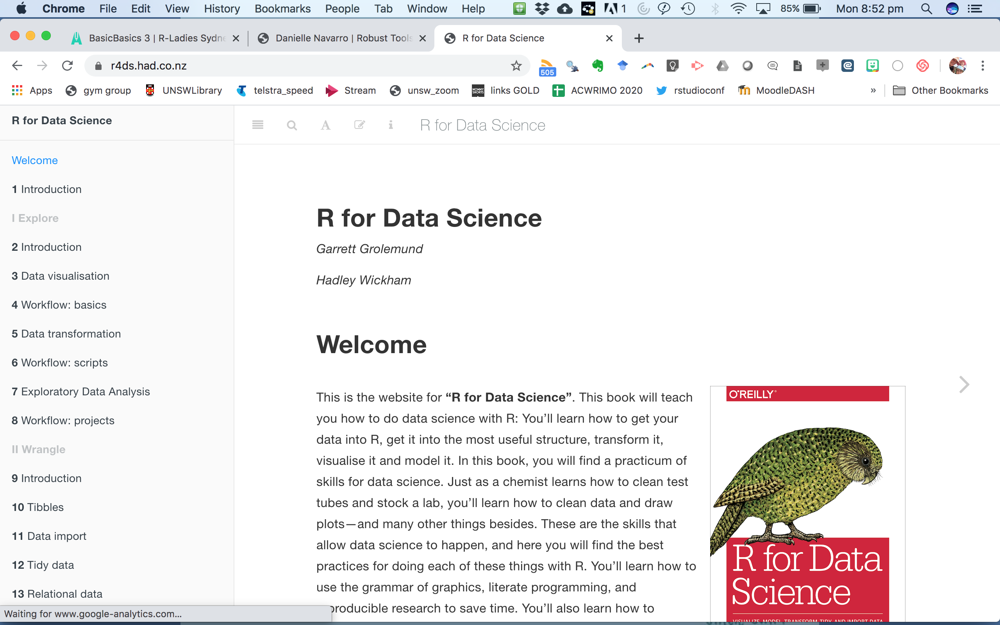
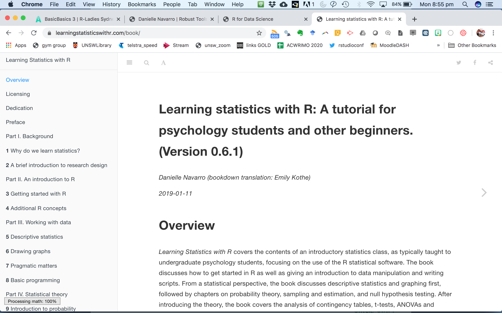

```{r setup, include=FALSE}
knitr::opts_chunk$set(echo = FALSE)

```

### 1. The R-Studio Education site

[Alison Hill](@apreshill) and her team at RStudio have pulled together the best resources for beginners at the RStudio Education site. Cute art by [Desiree de Leon](@descoyssle) make the site a joy to explore. 

```{r rsed, echo=FALSE, fig.cap="The Beginners page from R-Studio Education", out.width= 400}


```


### 2. R-Ladies Sydney #RYouWithMe

The #RYouWithMe course by R-Ladies Sydney is a series of online modules that walk you through getting data into R, cleaning it up a bit, visualising it, and reporting using RMarkdown. Lots of screencasts and practice exercises using enterococci data collected from Sydney beaches. 

```{r ryouwithme, echo=FALSE, fig.cap="RYouWithMe from R-Ladies Sydney", out.width= 400}

```


### 3. Robust Tools course and YouTube channel

Dani has made a great site pulling her [Robust Tools course](https://robust-tools.djnavarro.net/) materials into one place. Lots to be learned by watching her live code on the associated [YouTube channel](https://www.youtube.com/channel/UCfNGzUFfsy_3udMY8UyaqBA/playlists?view=50&flow=grid&shelf_id=3) too. 

```{r robust, echo=FALSE, fig.cap="Robust Tools by Dani Navarro", out.width= 400}

```

### 4. R for Data Science book

If books are more your scene, the free online R for Data Science book by Hadley Wickham is free online. Its definitely worth checking out this tidyverse bible. 

```{r r4ds, echo=FALSE, fig.cap="R for Data Science by Hadley Wickham", out.width= 400}

```

### 5. Learning Statistics with R (by Danielle Navarro)

If you are keen to go beyond wrangling and visualising and to get some analysis done in R, Dani's book is a agreat palce to start. It is genuinely fun to read (uncommon for a stats book) and covers basic statistical analysis. Also free and available online. 

```{r lsr, echo=FALSE, fig.cap="Learning Statistics with R by Dani Navarro", out.width= 400}

```
